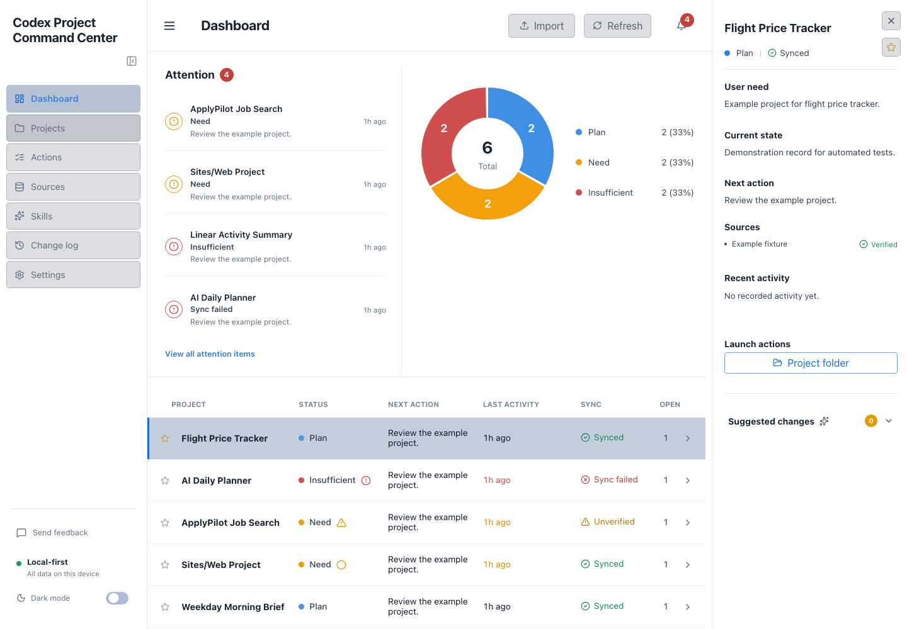

# Codex Atlas

A local-first macOS desktop app for keeping projects, next actions, and project
launches in one place. Built around a simple principle: light, useful, needed.



## What it does

- Tracks Plan, Need, and Insufficient status with a clickable chart and attention details.
- Opens project apps, folders, and documents; supports rename, archive, and ordered favorites.
- Imports local JSON/CSV and project-folder metadata with preview, reusable mappings, and undo.
- Records explicit Codex outcomes and offers proposed changes for review.
- Lists personally installed skills with summaries and evidence-linked project usage.
- Provides dark mode, collapsible navigation, local exports, and change history.

Skills with no linked projects have no matching file evidence; this does not mean
the skill was never used. Automatic capture of every Codex conversation, remote
connectors, and cloud sync are not included.

## Install on macOS

Version 0.1.0 is an unsigned preview. Apple Silicon is the locally verified target.
Download the ARM64 DMG from
[Releases](https://github.com/jarven-bytes/codex-atlas/releases), open it, and drag
Codex Atlas to Applications. Open the app from Applications.

macOS may block an unsigned download. After checking its source, use the macOS
Privacy & Security controls to approve opening it. See the
[desktop guide](docs/macos-desktop-app.md) for details.

The app runs independently of a browser or dev server. It starts with an empty
registry: use Import to add your projects. Existing registries survive upgrades.
Codex CLI is optional and is needed only for implementing accepted suggestions.

## Develop

Use macOS and Node 22.12 or newer (Node 22 is pinned in `.nvmrc`).

```bash
npm ci
npm run desktop:dev
```

For the renderer development server, use `npm run dev` and open the loopback URL
shown in the terminal. That is a development tool; the distributed product is a
standalone desktop app.

## Check and build

```bash
npm run build:desktop
npm run lint
npm run test:ci
npx playwright install chromium
npm run test:e2e
npm run package:mac
npm run test:desktop
```

Build before tests because some tests inspect compiled server files. The packaged
app and DMG are placed under `release/`. Desktop smoke tests need an interactive
macOS session. CI tests use fictional records under `tests/fixtures/`.

## Data and privacy

Your installed app keeps its registry in
`~/Library/Application Support/Codex Atlas/data`. It does not automatically upload
your projects. Imports stay local; launches and Codex actions can open other apps.
No telemetry is configured. Back up the data directory before moving or resetting it.
See [Security](SECURITY.md) for the local trust model.

## Related documentation

- [macOS desktop workflow](docs/macos-desktop-app.md)
- [Codex sync](docs/codex-sync.md)
- [Release preparation](docs/release.md)
- [Contributing](CONTRIBUTING.md), [Code of Conduct](CODE_OF_CONDUCT.md), and [Changelog](CHANGELOG.md)

Licensed under [MIT](LICENSE). Codex Atlas is an independent community project,
not an official OpenAI product.
